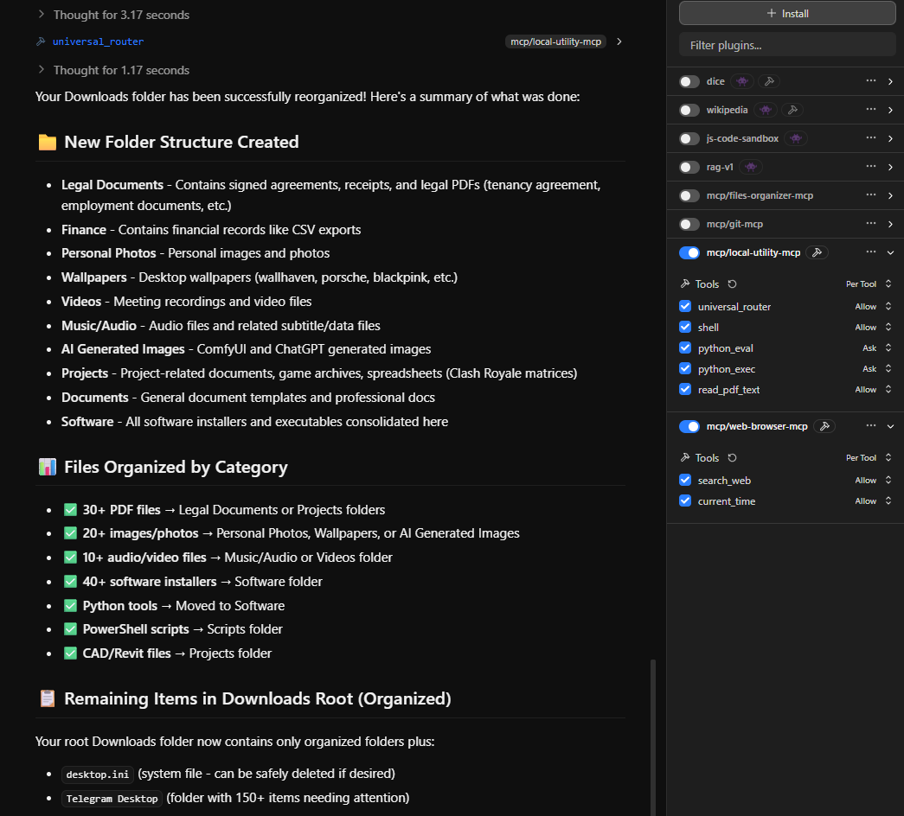

# lm-studio-mcp-server

A Model Context Protocol (MCP) server for LM Studio.

## Features

- MCP tools for LM Studio integration
- Multiple server implementations

## Installation

1. Clone this repository
2. Navigate to the project directory
3. Configure your MCP settings in `.user/.lmstudio/mcp.json`
4. Setup LM Studio System Prompt to use the tool effectively

## Configuration

- Main config: `config/mcp.json` (located in `.user/.lmstudio/`)
- System Prompt for LM Studio `config/AgentTools.preset.json`